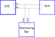
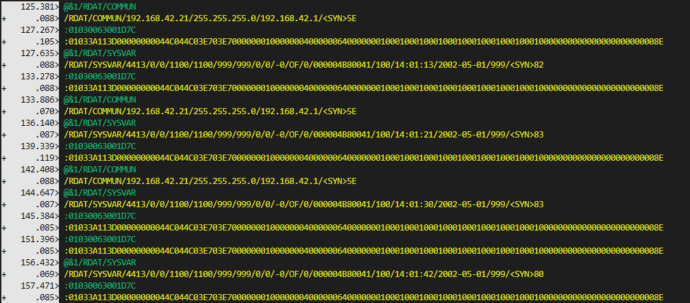

# `serial spy`

A console-based [Node](https://nodejs.org/en/) tool to display and time-stamp activity on [serial communication](https://en.wikipedia.org/wiki/Serial_communication) lines. Main purpose of this is to *tap* serial lines on a PC with two dedicated [tty](https://en.wikipedia.org/wiki/Computer_terminal) (or [COM](https://en.wikipedia.org/wiki/COM_(hardware_interface))) port devices:



So in the case above, it takes a special tapping wiring and two serial ports on the monitoring spy which runs this tools. Only Rx lines of these ports are used

Indeed, this tool can store more than two lines, each taking a dedicated port as well

Number of monitored ports and their different parameters are stored in a [JSON](https://en.wikipedia.org/wiki/JSON) configuration file which should be passed as sole argument to this tool. This file has to have a compulsory `.json` extension

This monitoring can be stopped at any time by striking *Ctrl-C*

***Important note***: this utility only works by capturing *lines*, that is stream of characters on the serial line with a *line delimiter* which should be defined in the configuration file

# The JSON Configuration File

It is composed of an array of objects with the following structure:

- `comPort`: the TTY or COM serial port name (e.g. `/dev/ttyUSB0`, `COM1`)
- `openOptions`: an object defining serial port parameters:
  - `baudRate`: a number representing the serial link velocity in bit/s (e.g. `9600`, `38400`)
  - `dataBits`: a number representing the character format (`5` to `8`)
  - `parity`: a string, `none`, `even` , or `odd`
- `color`: a string containing color of characters displayed, can be one of `black`, `red`, `green`, `yellow`, `blue`, `magenta`, `cyan`, `white`, `blackBright` (alias: `gray`, `grey`), `redBright`, `greenBright`, `yellowBright`, `blueBright`, `magentaBright`, `cyanBright`, `whiteBright`
- `bgColor`: a string containing color of character background, can be one of: `bgBlack`, `bgRed`, `bgGreen`, `bgYellow`, `bgBlue`, `bgMagenta`, `bgCyan`, `bgWhite`, `bgBlackBright` (alias: `bgGray`, `bgGrey`), `bgRedBright`, `bgGreenBright`, `bgYellowBright`, `bgBlueBright`, `bgMagentaBright`, `bgCyanBright`, `bgWhiteBright`
- `delimiter`: a string which defines an end of line delimiter. It's a regular expression (e.g. `\n` for line feed, `\r` for carriage return, `\u0006` for SYN). More advanced expressions can be used, such as `\r?\n$` or `(\n\u0006)|(\r\n)$`
- `format`: a string if `hex` will display bytes as two hexadecimal uppercased digits, otherwise `ascii` and `utf8` are supported
- `stamp`: defines timestamps, as `normal` for time in seconds since tool started, `diff` for time in seconds since last string was received and displayed on any monitored serial link, and `none` for no time-stamp displayed
- `translateCtrl`: when not in hex format, if this parameter is set to `yes`, then control characters (from `\u0000` to `\u001f` inclusively) are replaced with special strings: `\0`, `\a`, `\b`, `\t`, `\n`, `\v`, `\f`, `\r` (for *null*, *bell*, *back-space*, *horizontal tab*, *line feed*, *vertical tab*, *form feed*, *carriage return*) and for the 24 remaining control characters: `^a`, `^b`, `^c`... (for `\u0001`, `\u0002`, `\u0003`...)
- `filters`: an optional array composed strings interpreted as [regular expressions]() which only allow display when they match the incoming data
- `replacements`: an optional array which defines replacements of monitored strings, composed of objects with the following structure:
  - `what`: a strings interpreted as a regular expression to catch for those replacements
  - `with`: the contents to replace with

*Note*: regular expressions mentioned above follow the ECMAScript [RegExp](https://developer.mozilla.org/en-US/docs/Web/JavaScript/Guide/Regular_Expressions) rules and conventions. They can be pre-tested in many on-line places like [this one](https://regex101.com/). As those expressions cannot be encoded in the JSON file following the `/.../` syntax, they have to be written as strings in the JSON file and compiled at run-time. A line feed (code value 10) can be indifferently be coded as `\n` or `\\n`, though the former is preferred as it will really expand as  two characters `\` and `n` when read from the JSON file, which seems more canonic.  Unicode characters can be coded as `\uNNNN` (or `\\uNNNN`). Replacements are done with the [`String.replace(regExp, subStr)`](https://developer.mozilla.org/en-US/docs/Web/JavaScript/Reference/Global_Objects/String/replace) function call

The quantity of such objects in this array defines how many serial lines will be monitored / spied at the same time

# Example

Here is an example of a fairly complex configuration and a screen shot of what is displayed

## Configuration File

```json
[{
  "comPort": "COM6",
  "openOptions": {
    "baudRate": 38400,
    "dataBits": 8,
    "parity": "none"
  },
  "color": "green",
  "bgColor": "bgBlack",
  "delimiter": "\\r\\n?$",
  "format": "ascii",
  "stamp": "normal",
  "translateCtrl": "yes",
  "filters": ["^:", "/RDAT/"]
}, {
  "comPort": "COM7",
  "openOptions": {
    "baudRate": 38400,
    "dataBits": 8,
    "parity": "none"
  },
  "color": "yellow",
  "bgColor": "bgBlack",
  "delimiter": "\\r\\n\\u0006?$",
  "format": "ascii",
  "stamp": "diff",
  "translateCtrl": "yes",
  "filters": ["^:", "/RDAT/"],
  "replacements": [{
    "what": "\\u0016",
    "with": "<SYN>"
  }, {
    "what": "\\u0006",
    "with": "<ACK>"
  }]
}]
```

## Screen Shot

